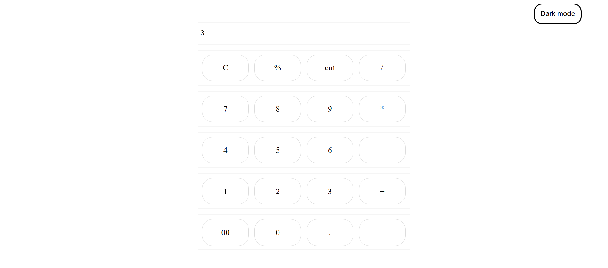
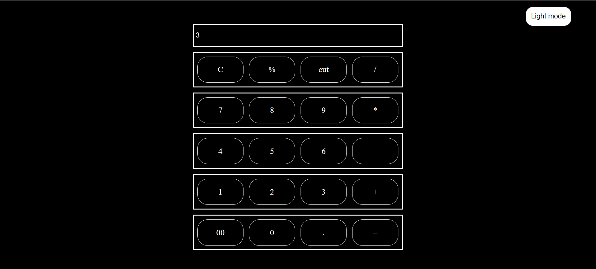

# Calculator Application :heavy_plus_sign: :heavy_minus_sign: :heavy_multiplication_x: :heavy_division_sign:

## Overview :clipboard:

The Calculator Application is a straightforward web-based tool that empowers users to execute fundamental mathematical operations, such as addition, subtraction, multiplication, and division. It boasts a user-friendly interface with a responsive design, ensuring seamless usage across various screen sizes.

## Features :rocket:

- **Basic Operations:** Execute addition, subtraction, multiplication, and division calculations effortlessly.

- **Dark Mode:** Toggle between light and dark modes for enhanced usability, particularly in low-light environments.

- **Keyboard Support:** Leverage keyboard input for numbers and operators, streamlining your calculations.

## Usage :computer:

1. Launch the `index.html` file in your preferred web browser.

2. Input a mathematical expression using the on-screen buttons or your keyboard.

3. Click the "=" button or press the "Enter" key to compute the result.

4. To clear the input field, click the "C" button.

5. For removing the last character from the input, click the "cut" button or press the "Backspace" key.

6. Explore various mathematical expressions and enjoy a seamless calculation experience.

### Dark Mode

## Technical Details :wrench:

- **Technologies Used:** HTML, CSS, JavaScript

- **Responsive Design:** The calculator application is meticulously designed to be responsive, ensuring optimal performance on diverse screen sizes, including desktop and mobile devices.

- **Keyboard Input:** Harness the convenience of keyboard input for numbers and operators, making the calculator even more efficient.

## Contributing :handshake:

We welcome contributions and suggestions! Feel free to open an issue or submit a pull request to contribute to the enhancement of this calculator application.
